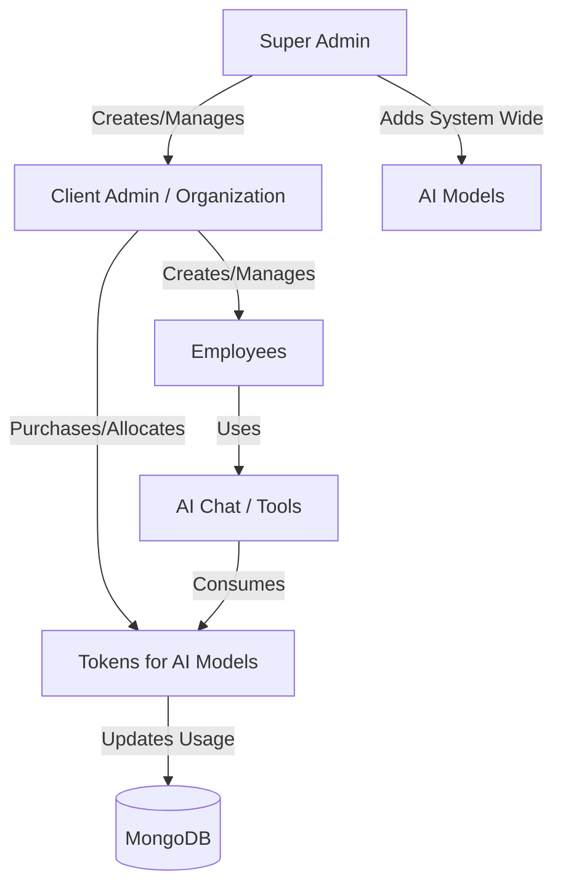
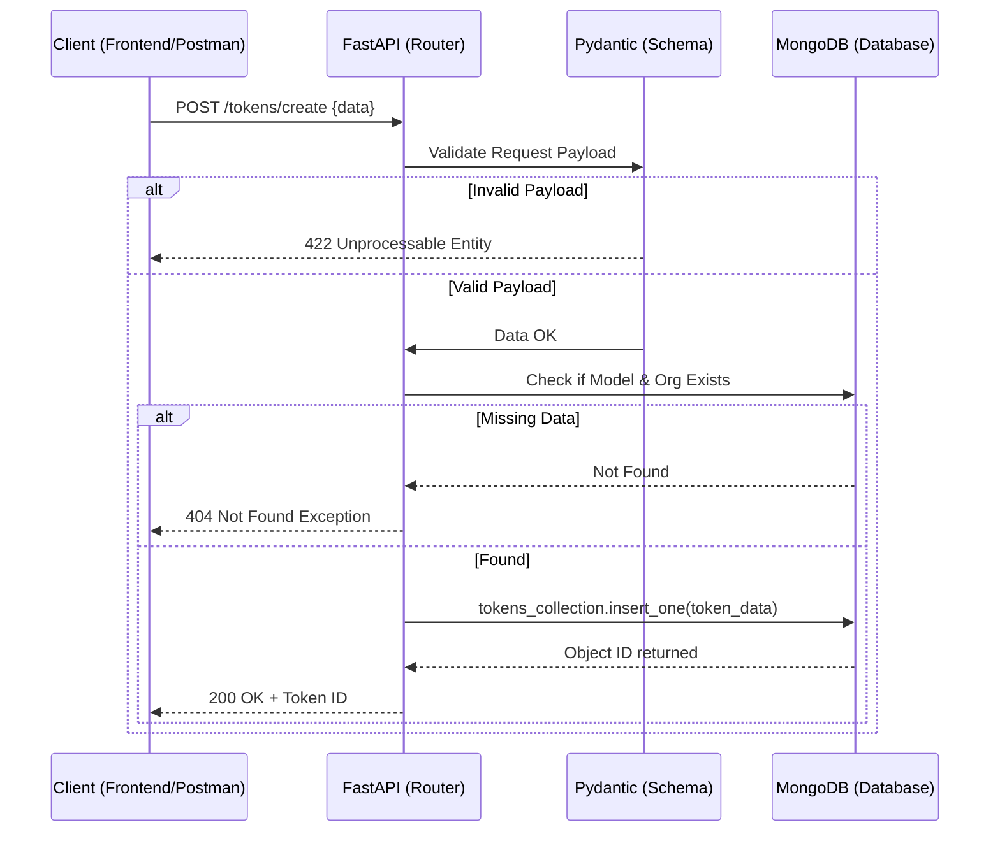

# Flow Diagrams

This document contains Mermaid diagrams illustrating the fundamental workflows within the **Binjwa AI Cost Platform**.

## 1. User Hierarchy & Token Allocation Flow

## 2. API Request Flow

